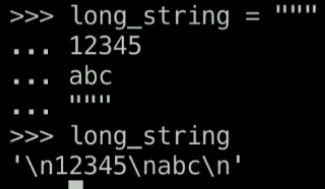
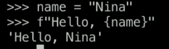

# Notes 🐍

- [Intro](#intro)
- [Variables and Data Types](#variables-and-data-types)
  - [Numbers](#numbers)
  - [Strings](#strings)
  - [Lists](#lists)
  - [Tuples](#tuples)
  - [Sets](#sets)
  - [Dictionaries](#dictionaries)
- [Functions](#functions)

## Intro

-   REPL (Read-Evaluate-Print-Loop): Interactive shell that allows you to enter Python commands and directly see the results. [Source](https://python.land/introduction-to-python/the-repl).
-   Errors should be read bottom to top.
-   `help()`
-   `#` for comments.
-   Everything is an object.

## Variables and Data Types

-   **Python is a dynamic language**. We don't need to declare the type of the variable before we store data in them. Just like JS.
-   PEP8 conventions:
    -   Lowercase
    -   No spaces. Words separated by `_`.
    -   Can't start with a number.
-   `type(variable_name)` indicates the type of value
-   `None` means nothing, none type.
-   **`print()`**. Prints some variable out in the terminal. `print("My name is", name)` will print `My name is Manuel` (including the space before the name).
-   **`dir()`** shows the available methods for something. `dir(int)` will show methods for integers.
-   **`help()`**. One of int's methods is `real`. We can do `help(int.real)` and that will show some info for us.

### Numbers

-   Types:
    -   Integers: `0`, `-310`, `0`
    -   Float: `5.0`, `-342.4`, `0.0`
    -   Complex: `42j`
-   We cant create instances of numbers using `int(5)` or `float(3.0)`
-   `6/2`=`3.0` (result of diving is a float number), `3*3`=`9`

### Strings

-   Can use single (`'`) or double (`"`) quotes. It's considered best practice to use double quote because you may need to put a single quote within your string: `'Hello N's'` will return an error, instead of that is better to type `"Hello N's"`
-   `+` concatenates strings: `"Nina" + " Z"` will return `"Nina Z"`
-   **Long strings** can be declared with triple quotes `long_string="""`. That will produce a different prompt in the REPL. `...` instead of `>>>`. That means the REPL is waiting for more input. When its done, we'll write `"""` again and that will be stored in the variable. . `\n` represents a new line.
-   **f-string** is a new fancy way of string formatting. 

```py
>>> a = float(5)
>>> type(a)
<class 'float'>
>>> a
5.0
```

### Lists

-   Lists are used for storing similar items, and in cases where items need to be added or removed.
-   Should not be named "list".
-   Can have different variable types inside.
-   Declared just with `[]` or calling the constructor `list()`. `names=["Nina", "Max", "Jane"]`.
    -Python is zero indexed, to it starts counting in 0. To access some item of the list by its index, we type the name and the index between `[]`. `names[0]`, `names[1]`... If we ask for an index out of range an error will pop up: `IndexError: list index out of range`.
-   Items in a lists can be declared line by line. Trailing commas (final commas) on like JSON are allowed. In fact, in Python, they're encouraged because they really help with diffs and version control. 
-   Lists are mutable, meaning they can be changed and updated.
-   Searching for an item in a large list is slow because each item must be checked.

-   Methods

    -   Counting:
        -   `len(my_list)` returns the length of a list.
        -   `my_list.count(item)` returns how many times an item appear in the list.
    -   Updating:
        -   `my_list.append(item)` to add new values
        -   `my_list.insert(index, item)` to insert an item at `index` position.
        -   `my_list.pop()` with no arguments will remove the last item and return it (pop it). We can also pass the index as an argument.
        -   `my_list.remove(item)` removes an item of the list. If the item appears more than once, it will just removed the first one (the one with the lower index).
    -   Sorting:

        -   `sorted(my_list, [reverse=true])` can sort items in a list. It doesn't change the original list.

            ```py
            >>> littery_numbers
            [1, 4, 1993, 7]
            >>> sorted(lottery_numbers)
            [1, 4, 7, 1993]
            >>> lottery_numbers
            [1, 4, 1993, 7]
            >>> sorted(lottery_numbers, reverse=True)
            [1993, 7, 4, 1]
            >>> lottery_numbers
            [1, 4, 1993, 7]
            ```

        -   `my_list.sort()` does change the order of the original list.

            ```py
            >>> lottery_numbers.sort()
            >>> lottery_numbers
            [1, 4, 7, 1993]
            ```

    -   Searching:

        -   `my_list.index(item)` will return the index of that item. If `names = ["Nina", "Max", "Phillip", "Nina"]` and we type `names.index("Nina")`, despite of "Nina" being twice, Python will just return the index of the first result, `0`.
        -   `item in my_list`, like `1 in lottery_numbers`. It returns `True` if the item is in the list.

### Tuples

Lightweight collections used to keep track of related but different items.

-   Sorted.
-   Defined by `(,)`. And the comma is important. If you want to define a tuple with just one item, you need to put the trailing comma.

    ```py
    >>> my_tup = ()
    >>> my_tup = ("hi")
    >>> type(my_tup)
    <class 'str'>
    >>> my_tup = (1,)
    >>> type(my_tup)
    <class 'tuple'>
    >>> x = 1, 2, 3
    >>> type(x)
    <class 'tuple'>
    >>> def http_status_code():
    ... return 200, "OK"
    ...
    >> http_status_code()
    (200, 'OK') # A tuple
    ```

-   **Tuples are immutable**

    ```py
    student = ("Marcy", 8, "History", 3.5)
    student[0] # Marcy
    student[0] = "Nina"
    # 🚨 ERROR!
    ```

-   Tuple unpacking is getting multiple items out of a tuple at once. To do dat, we can create variables and assign them to a tuple. The number of variables must match the number of items in the tuple. If you don't care for an item, use `_`. This also work will lists, but is least common.

    ```py
    student # ("Marcy", 8, "History", 3.5)
    name, age, subject, gpa = student
    name # 'Marcy'
    age # 8
    name, age, _, gpa = student

    ```

### Sets

-   Mutable datatype that allows you to store **immutable** types in an unsorted way.
-   They only can contain immutable types, so not lists, sets or dictionaries.

    ```py
    # Check if type is mutable by using hash()
    hash(5) # 5
    hash("Name") # 51513515315136161
    hash([]) # TypeError: unhashable type: 'list'
    ```

-   Cannot have duplicate values.
-   Fast
-   Created using `{}`, but be careful!

    ```py
    type({1, 2}) # <class 'set'>

    # If we try to create an empty set, just with {}, that'll be a dictionary
    my_new_set = {}
    type(my_new_set) # <class 'dict'>

    # For that cases, we'll use the set constructor
    type(set()) # <class 'set'>
    ```

-   Can't have duplicate values.

    ```py
    my_set = {3, 3, 5}
    my_set #{3, 5}

    # We can convert a list to a set and remove duplicates
    names = ["Nina", "Nina", "Max"]
    set(names)
    names # {'Max', 'Nina'}
    ```

-   They don't have an order, as we just saw in the prior names example. So we cannot access items by their index.

    ```py
    my_set = {"a", 1, 2, 4, "Nina"}
    my_set # {1, 2, 4, 'a', 'Nina'}
    my_set[0] # TypeError: 'set' object is not subscriptable
    ```

-   Methods

    -   Add and remove items: `add`, `discard`

        ```py
        my_set.add("Orange")
        my_set.discard("Nina")
        my_set # {1, 2, 4, 'a', 'Orange'}

        ```

    -   Combining sets with `update`, `union` or just `|`

        ```py
        numbers = {1, 2, 3}
        colors = {"Red", "Orange"}
        colors.update(numbers)
        colors # {'Red', 1, 2, 3, 'Orange'}
        # Items of colors have been updated.
        ```

        ```py
        colors = {"Red", "Green", "Blue"}
        favorite_colors = {"Blue", "Black"}

        colors | favorite_colors
        # {'Green', 'Red', 'Black', 'Blue'}
        # This won't change colors neither favorite_colors, they will remain the same.

        colors.union(favorite_colors)
        {'Green', 'Red', 'Black', 'Blue'}
        # This won't change colors neither favorite_colors, they will remain the same.
        ```

    -   Searching

        ```py
        colors = {"Red", "Green", "Blue"}
        "Blue" in colors # True
        "Orange" in colors # False
        ```

    -   Intersection `&`

        ```py
        colors = {"Red", "Green", "Blue"}
        favorite_colors = {"Blue", "Black"}

        colors & favorite_colors
        # {'Blue'}
        ```

    -   Difference `^`

        ```py
        colors = {"Red", "Green", "Blue"}
        favorite_colors = {"Blue", "Black"}

        colors ^ favorite_colors
        # {'Black', 'Green', 'Red'}
        ```

> 🧊 There's also a _frozen set_ if you want a set to be immutable.

### Dictionaries

-   Allows us to **store key and value pairs**.
-   **Mutable, but!** Dictionaries themselves are mutable, but, just like sets, dictionary keys can only be **immutable types**, because dictionary keys need to be hashable.
-   We define dictionaries with `{:}`, but we can create an empty dictionary just with `{}`, as we've seen before.

    ```py
    type({"one": 1, "two": 2}) # <class 'dict>
    ```

-   **Fast lookup**. Dictionaries allow fast item lookup and fast membership testing. You can quickly say, given a key is this key in my dictionary or not.And that's because the hash of the key is compared with the hash of the keys in the dictionary, don't have to look through it each item in that dictionary and say,are are you the item, are you the item, are you the item that I'm looking for?
-   Hence lists cannot be dictionary keys, but tuples can.
-   **Unordered**. Like sets, dictionaries do not have an order.

    ```py
    my_dict = {"one": 1, "two": 2}
    my_dict[0] # KeyError: 0
    my_dict["one"] # 1
    ```

-   

## Functions

-   Functions are define by `def`, then the name, `()` and `:`.
-   Instead of brackets, like we use in JS, in Python the body of the function is indicated by indentation.
