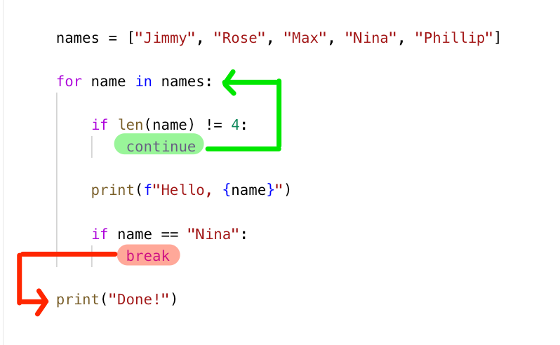

# Notes 🐍

-   [Intro](#intro)
    -   [`py` files](#py-files)
-   [Variables and Data Types](#variables-and-data-types)
    -   [Numbers](#numbers)
    -   [Strings](#strings)
    -   [Lists](#lists)
    -   [Tuples](#tuples)
    -   [Sets](#sets)
    -   [Dictionaries](#dictionaries)
-   [Functions](#functions)
    -   [Scope](#scope)
    -   [Constants](#constants)
-   [Boolean Logic, Looping and Control Flow](#boolean-logic-looping-and-control-flow)
    -   [Boolean Logic](#boolean-logic)
    -   [`if` statements](#if-statements)
    -   [Loops](#loops)
-   [Libraries and Modules](#libraries-and-modules)
    -   [Modules](#modules)
    -   [External libraries](#external-libraries)
-   [Using Python](#using-python)
    -   [Debugging](#debugging)
    -   [`main` Method](#main-method)
    -   [`try-except`](#try-except)
-   [Object Oriented Python](#object-oriented-python)
-   [Web Frameworks](#web-frameworks)
-   [APIs](#apis)
    -   [HTTP Methods](#http-methods)
    -   [Headers, Body and Parameters](#headers-body-and-parameters)
    -   [Response Types](#response-types)
    -   [HTTP status Codes](#http-status-codes)
    -   [`resquests` + APIs](#resquests--apis)
    -   [Practice: GitHub stars](#practice-github-stars)

## Intro

-   REPL (Read-Evaluate-Print-Loop): Interactive shell that allows you to enter Python commands and directly see the results. [Source](https://python.land/introduction-to-python/the-repl).
-   Errors should be read bottom to top.
-   `help()`
-   `#` for comments.
-   Everything is an object.

### `py` files

-   Filenames should be _all_ lowercase
-   Words should be separated with underscores `_`
-   Filenames should be short.
-   ✅ Some good example filenames: `apis.py`, `exceptions.py`, `personal_blog.py`
-   ⛔️ Some bad example filenames: `MYFILE.PY`, `my_apis.py`, `CamelCaseFile.py`, `really_long_over_descriptive_project_file_name.py`

To run a `.py` file: `python filename.py`. In VSC it's good to exit the REPL before.

#### `*.pyc` files

For optimization and other reasons, Python code can be compiled to intermediary `.pyc` files.

The good news is you don’t have to worry about them. The bad news is, very occasionally stale versions of these compiled files can cause problems. To safely delete them from the current project directory, run find . -name "\*.pyc" -delete (on linux or macOS).

💡 **git tip**: use a `.gitignore` for Python. If you use git for source control, you’ll want to make sure that these compiled `*.pyc` files are ignored and not added to your repository. The best way to do this is to add the standard `.gitignore` file for Python to your project.

## Variables and Data Types

-   **Python is a dynamic language**. We don't need to declare the type of the variable before we store data in them. Just like JS.
-   PEP8 conventions:
    -   Lowercase.
    -   No spaces. Words separated by `_`.
    -   Can't start with a number.
-   `type(variable_name)` indicates the type of value
-   `None` means nothing, none type.
-   **`print()`**. Prints some variable out in the terminal. `print("My name is", name)` will print `My name is Manuel` (including the space before the name).
-   **`dir()`** shows the available methods for something. `dir(int)` will show methods for integers.
-   **`help()`**. One of int's methods is `real`. We can do `help(int.real)` and that will show some info for us.

### Numbers

-   Types:
    -   Integers: `0`, `-310`, `0`
    -   Float: `5.0`, `-342.4`, `0.0`
    -   Complex: `42j`
-   We cant create instances of numbers using `int(5)` or `float(3.0)`
-   `6/2`=`3.0` (result of diving is a float number), `3*3`=`9`

### Strings

-   Can use single (`'`) or double (`"`) quotes. It's considered best practice to use double quote because you may need to put a single quote within your string: `'Hello N's'` will return an error, instead of that is better to type `"Hello N's"`
-   `+` concatenates strings: `"Nina" + " Z"` will return `"Nina Z"`
-   **Long strings** can be declared with triple quotes `long_string="""`. That will produce a different prompt in the REPL. `...` instead of `>>>`. That means the REPL is waiting for more input. When its done, we'll write `"""` again and that will be stored in the variable. . `\n` represents a new line.
-   **f-string** is a new fancy way of string formatting. 

```py
>>> a = float(5)
>>> type(a)
<class 'float'>
>>> a
5.0
```

-   Methods:

    -   `string.split(token)` will split a string into pieces (creating a list) depending on the token.

        ```py
        names = "Nina,Max,Mark,Mike,Rose"
        names_list = names.split(",")
        print(names_list)
        # ['Nina', 'Max', 'Mark', 'Mike', 'Rose']
        ```

### Lists

-   Lists are used for storing similar items, and in cases where items need to be added or removed.
-   Should not be named "list".
-   Can have different variable types inside.
-   Declared just with `[]` or calling the constructor `list()`. `names=["Nina", "Max", "Jane"]`.

    -   Python is zero indexed, to it starts counting in 0. To access some item of the list by its index, we type the name and the index between `[]`.

        ```py
        >>> names=["Nina", "Max", "Jane"]
        >>> names[0]
        'Nina'
        >>> names[4]
        Traceback (most recent call last):
        File "<stdin>", line 1, in <module>
        IndexError: list index out of range
        >>> names[-1]
        'Jane'
        ```

-   Items in a lists can be declared line by line. Trailing commas (final commas) on like JSON are allowed. In fact, in Python, they're encouraged because they really help with diffs and version control. 
-   Lists are mutable, meaning they can be changed and updated.
-   Searching for an item in a large list is slow because each item must be checked.

-   Methods

    -   Counting:
        -   `len(my_list)` returns the length of a list.
        -   `my_list.count(item)` returns how many times an item appear in the list.
    -   Updating:
        -   `my_list.append(item)` to add new values
        -   `my_list.insert(index, item)` to insert an item at `index` position.
        -   `my_list.pop()` with no arguments will remove the last item and return it (pop it). We can also pass the index as an argument.
        -   `my_list.remove(item)` removes an item of the list. If the item appears more than once, it will just removed the first one (the one with the lower index).
        -   `del my_list[index]` will also remove the item with that index, but it's not a recommended method.
    -   Sorting:

        -   `sorted(my_list, [reverse=true])` can sort items in a list. It doesn't change the original list.

            ```py
            >>> lottery_numbers
            [1, 4, 1993, 7]
            >>> sorted(lottery_numbers)
            [1, 4, 7, 1993]
            >>> lottery_numbers
            [1, 4, 1993, 7]
            >>> sorted(lottery_numbers, reverse=True)
            [1993, 7, 4, 1]
            >>> lottery_numbers
            [1, 4, 1993, 7]
            ```

        -   `my_list.sort()` does change the order of the original list.

            ```py
            >>> lottery_numbers.sort()
            >>> lottery_numbers
            [1, 4, 7, 1993]
            ```

    -   Searching:

        -   `my_list.index(item)` will return the index of that item. If `names = ["Nina", "Max", "Phillip", "Nina"]` and we type `names.index("Nina")`, despite of "Nina" being twice, Python will just return the index of the first result, `0`.
        -   `item in my_list`, like `1 in lottery_numbers`. It returns `True` if the item is in the list.

    -   Other methods:

        -   `string.join(my_list)`. If we have a list of items, we can join them using a string.

            ```py
            my_data = ['this', 'is', 'comma', 'separated', 'data']
            ":".join(my_data)
            # 'this:is:comma:separated:data'
            ```

#### Lists comprehensions

> [!note]
> You may want to check other chapters, like Boolean Logic, before reading 'Lists comprehensions'.

List comprehensions are a unique way to create lists in Python. A list comprehension consists of brackets containing an expression followed by a for clause, then zero or more for or if clauses. The expressions can be any kind of Python object.

List comprehensions will commonly take the form of `[<value> for <vars> in <iter>]`. So its recommended to write it backwords, first `[]` because we want a list, then `for <vars> in <iter>` because we know what should be looped, and finally what do exactly want, `<value>`.

If we want a list of the length of the names of another list, we'll write: `[len(name) for name in names]`

```py
names = ["Nina", "Max", "Rose", "Jimmy"]
my_list = [len(name) for name in names]
print(my_list)
# [4, 3, 4, 5]
```

We can also use comprehensions to perform operations, and the lists we assemble can be composed of any type of Python object. For example:

```py
names = ["Nina", "Max", "Rose", "Jimmy"]
my_list = [("length", len(name) * 2) for name in names]
print(my_list)
# [('length', 8), ('length', 6), ('length', 8), ('length', 10)]
```

In the above example, we assemble a list of tuples - each tuple contains the element “length” as well as each number from the `len()` function multiplied by two.

We can also use conditionals:

```py
names = ["Nina", "Max", "Rose", "Jimmy"]
my_list = [len(name) for name in names if len(name) % 2 == 0]
print(my_list)
# [4, 4]
```

We can also use `split()` and `join()` join. But remember we cannot join numbers, only strings, so we'd have to convert them beforehand. And that's easy with a list comprehension:

```py
>>> my_list = [0, 1, 2, 3, 4]
>>> my_string = ",".join([str(num) for num in my_list])
>>> print(my_string)
0,1,2,3,4
```

Note: you can also accomplish the same thing with the map function, a functional programming concept implemented in Python.

We can also use some mathematical functions such as `sum`, `min`, and `max`, which accept lists of numbers to operate on. For example, to get the sum of numbers between zero and five:

```py
my_sum = sum([0, 1, 2, 3, 4])
print(my_sum)
```

Remember, **anywhere you can use a list, you can use a list comprehension**. Say you want to get sum, minimum, and maximum of every number between 0 and 100 that is evenly divisible by 3? No sense typing out a whole list in advance, just use a comprehension:

```py
>>> my_sum = sum([num for num in range(0, 100) if num % 3 == 0])
>>> print(my_sum)
1683
>>> my_min = min([num for num in range(0, 100) if num % 3 == 0])
>>> print(my_min)
0
>>> my_max = max([num for num in range(0, 100) if num % 3 == 0])
>>> print(my_max)
99
```

#### Generator Expressions

Generator expressions are a more advanced concept. A generator is a type of iterable object - like a list, you can iterate through each element - however, unlike a list, generators evaluate elements on demand, instead of assembling them all at once.

A generator comprehension looks just like a list comprehension, except we use parentheses instead of brackets. For example, to get a list of the square of every even number between 0 and 10, we could do:

```py
# List comprehension
>>> list_comp = [x ** 2 for x in range(10) if x % 2 == 0]

>>> print(list_comp)
[0, 4, 16, 36, 64]

# Generator expression
>>> gen_exp = (x ** 2 for x in range(10) if x % 2 == 0)

>>> print(gen_exp)
<generator object <genexpr> at 0x10d48cc00>

>>> for num in gen_exp:
...     print(num)
...
0
4
16
36
64
```

The thing about generators though, is that once you use the generator, again **it doesn't have any state**. **It's not stored in memory**. So once you loop over all these items, the generator is **exhausted**, meaning you can only loop over them once, and you can’t reference items in a generator without first converting it to a list.

If we try to loop over the generator created in the previous example a second time, we won’t see any results.

#### Slicing

Slicing is a easy way to create sub-lists from larger lists.

### Tuples

Lightweight collections used to keep track of related but different items.

-   Sorted.
-   Defined by `(,)`. And the comma is important. If you want to define a tuple with just one item, you need to put the trailing comma.

    ```py
    >>> my_tup = ()
    >>> my_tup = ("hi")
    >>> type(my_tup)
    <class 'str'>
    >>> my_tup = (1,)
    >>> type(my_tup)
    <class 'tuple'>
    >>> x = 1, 2, 3
    >>> type(x)
    <class 'tuple'>
    >>> def http_status_code():
    ... return 200, "OK"
    ...
    >> http_status_code()
    (200, 'OK') # A tuple
    ```

-   **Tuples are immutable**

    ```py
    student = ("Marcy", 8, "History", 3.5)
    student[0] # Marcy
    student[0] = "Nina"
    # 🚨 ERROR!
    ```

-   Tuple unpacking is getting multiple items out of a tuple at once. To do dat, we can create variables and assign them to a tuple. The number of variables must match the number of items in the tuple. If you don't care for an item, use `_`. This also work will lists, but is least common.

    ```py
    student # ("Marcy", 8, "History", 3.5)
    name, age, subject, gpa = student
    name # 'Marcy'
    age # 8
    name, age, _, gpa = student

    ```

### Sets

-   Mutable datatype that allows you to store **immutable** types in an unsorted way.
-   They only can contain immutable types, so not lists, sets or dictionaries.

    ```py
    # Check if type is mutable by using hash()
    hash(5) # 5
    hash("Name") # 51513515315136161
    hash([]) # TypeError: unhashable type: 'list'
    ```

-   Cannot have duplicate values.
-   Fast
-   Created using `{}`, but be careful!

    ```py
    type({1, 2}) # <class 'set'>

    # If we try to create an empty set, just with {}, that'll be a dictionary
    my_new_set = {}
    type(my_new_set) # <class 'dict'>

    # For that cases, we'll use the set constructor
    type(set()) # <class 'set'>
    ```

-   Can't have duplicate values.

    ```py
    my_set = {3, 3, 5}
    my_set # {3, 5}

    my_set.add(3) # No error is shown.
    my_set # {3, 5}

    # We can convert a list to a set and remove duplicates
    names = ["Nina", "Nina", "Max"]
    set(names)
    names # {'Max', 'Nina'}
    ```

-   They don't have an order, as we just saw in the prior names example. So we cannot access items by their index.

    ```py
    my_set = {"a", 1, 2, 4, "Nina"}
    my_set # {1, 2, 4, 'a', 'Nina'}
    my_set[0] # TypeError: 'set' object is not subscriptable
    ```

-   Methods

    -   Add and remove items: `add`, `discard`

        ```py
        my_set.add("Orange")
        my_set.discard("Nina")
        my_set # {1, 2, 4, 'a', 'Orange'}

        ```

    -   Combining sets with `update`, `union` or just `|`

        ```py
        numbers = {1, 2, 3}
        colors = {"Red", "Orange"}
        colors.update(numbers)
        colors # {'Red', 1, 2, 3, 'Orange'}
        # Items of colors have been updated.
        ```

        ```py
        colors = {"Red", "Green", "Blue"}
        favorite_colors = {"Blue", "Black"}

        colors | favorite_colors
        # {'Green', 'Red', 'Black', 'Blue'}
        # This won't change colors neither favorite_colors, they will remain the same.

        colors.union(favorite_colors)
        {'Green', 'Red', 'Black', 'Blue'}
        # This won't change colors neither favorite_colors, they will remain the same.
        ```

    -   Searching

        ```py
        colors = {"Red", "Green", "Blue"}
        "Blue" in colors # True
        "Orange" in colors # False
        ```

    -   Intersection `&`

        ```py
        colors = {"Red", "Green", "Blue"}
        favorite_colors = {"Blue", "Black"}

        colors & favorite_colors
        # {'Blue'}
        ```

    -   Difference `^`

        ```py
        colors = {"Red", "Green", "Blue"}
        favorite_colors = {"Blue", "Black"}

        colors ^ favorite_colors
        # {'Black', 'Green', 'Red'}
        ```

> 🧊 There's also a _frozen set_ if you want a set to be immutable.

### Dictionaries

-   Allows us to **store key and value pairs**.
-   **Mutable, but!** Dictionaries themselves are mutable, but, just like sets, dictionary keys can only be **immutable types**, because dictionary keys need to be hashable.
-   We define dictionaries with `{:}`, but we can create an empty dictionary just with `{}`, as we've seen before.

    ```py
    type({"one": 1, "two": 2}) # <class 'dict>
    ```

-   **Fast lookup**. Dictionaries allow fast item lookup and fast membership testing. You can quickly say, given a key is this key in my dictionary or not.And that's because the hash of the key is compared with the hash of the keys in the dictionary, don't have to look through it each item in that dictionary and say,are are you the item, are you the item, are you the item that I'm looking for?
-   Hence lists cannot be dictionary keys, but tuples can.
-   **Unordered**. Like sets, dictionaries do not have an order. Or kind of sorted: since python 3.6 a dict is sorted by insertion order, however items can't be accessed by index.

    ```py
    my_dict = {"one": 1, "two": 2}
    my_dict[0] # KeyError: 0
    my_dict["one"] # 1
    my_dict["three"] # KeyError: 'three'
    ```

-   We can change values and add newer ones.

    ```py
    my_dict = {"one": 1, "two": 2}
    my_dict["two"] = "twotwotwotwo"
    my_dict["three"] = 3
    my_dict # {"one": 1, "two": "twotwotwotwo", "three": 3}
    ```

-   Methods:

    -   `get(item[, default])`. Catch items without returning KeyError. If `get` doesn't find what we're looking for, it returns nothing, and if we use its second optional parameter, it'll return that value.

        ```py
        my_dict = {"one": 1, "two": 2}
        my_dict["three"] # KeyError: 'three'
        my_dict.get("three") # (Nothing is returned)
        my_dict.get("three", "Ups!") # Ups!
        my_dict.get("two", "Ups!") # 2
        ```

    -   `update` can modify a dictionary and merge it with another.

        ```py
        my_dict = {"one": 1, "two": 2}
        my_other_dict = {"one": 1, "two": "dois", "three": 3}
        my_dict.update(my_other_dict)
        my_dict # {'one': 1, 'two': 'dois', 'three': 3}

        # Now will modify a list inside a dict with append:

        colors = {"Green": ["Spinach"]}
        vegetables = colors
        vegetables
        # {'Green': ['Spinach']}
        type(vegetables["Green"])
        # <class 'list'>
        vegetables["Green"].append("Apples")
        colors
        # {'Green': ['Spinach', 'Apples']}
        ```

    -   `keys()`, `values()` and `items()`. These methods will return just the keys, just the values or both (items) of a dictionary. When we loop over a dictionary, it returns just the keys, so most of the time we will want to call `.items()`.

        ```py
        >>> nums = {'one': 1, 'two': 2, 'three': 3}
        >>> nums.keys()
        dict_keys(['one', 'two', 'three'])
        >>> nums.values()
        dict_values([1, 2, 3])
        >>> nums.items()
        dict_items([('one', 1), ('two', 2), ('three', 3)])
        >>> nums
        {'one': 1, 'two': 2, 'three': 3}
        ```

    -   Searching methods:

        -   `'value' in dict`:

            ```py
            >>> nums = {'one': 1, 'two': 2, 'three': 3}
            >>> 'one' in nums
            True
            >>> 'four' in nums
            False
            ```

## Functions

-   Functions help us organize our code in a way that's reusable, and accept arguments and defaults where needed.
-   Functions are define by `def`, then the name, `()` and `:`.
-   Instead of brackets, like we use in JS, in Python the body of the function is indicated by indentation. We're getting errors if `:` or other function's component is missing.
-   We can pass parameters in different orders and also use default values, as we can see here:

    ```py
    def hello_world():
        print("Hello, World!")

    hello_world() # Hello, World!

    def add_numbers(x, y):
        return x+y

    result = add_numbers(4, 1)
    print(result) # 5
    print(add_numbers(4, 2)) # 6

    def add_numbers(x, y, z=200):
        # z has a default value of 200
        return x-y+z

    print(add_numbers(1,2)) # 199
    print(add_numbers(1,2,1)) # 0

    # We can also pass out parameters in a different order
    print(add_numbers(z=1, y=2, x=10)) # 9
    ```

-   We shouldn't use mutable types as default arguments. In this case, we'll see that python we'll use the same instance of the list, so it will add new items every time the function is called.

    ```py
    def do_stuff(my_list=[]):
        my_list.append("stuff!")
        return my_list

    print(do_stuff()) # ['stuff!']
    print(do_stuff()) # ['stuff!', 'stuff!']
    print(do_stuff()) # ['stuff!', 'stuff!', 'stuff!']
    ```

    ```py
    # One possible solution
    def do_stuff(my_list=None):
        if my_list == None:
            my_list = []
            my_list.append("stuff!")
        return my_list

    print(do_stuff()) # ['stuff!']
    print(do_stuff()) # ['stuff!']
    print(do_stuff()) # ['stuff!']
    ```

### Scope

If you define a variable inside a function, you wont be able to access it from other places. In general, scope in Python is the same as in other languages.

```py
name = "Nina"

def try_change_name():
    name = "Max"
    print(f"Name inside the function: {name}")

try_change_name()
# Name inside the function: Max

print(name)
# Nina

```

### Constants

-   A constant is a value that we expect to use several times within our code and don’t expect its value to change.
-   Uppercase, with the words separated by underscores.

```py
>>> ROOT_API_URL =  "https://api.github.com"
>>> def api_search_repos_url():
...     return f"{ROOT_API_URL}/search/repositories"
...
>>> api_search_repos_url()
'https://api.github.com/search/repositories'
>>>
```

## Boolean Logic, Looping and Control Flow

### Boolean Logic

-   It allows us to control the execution flow of our program.
-   `0` is `False`, all other numbers (including negative) are `True`
-   Empty containers (lists, tuples, sets and dicts) evaluate to `False`.
-   `None` is `False`.
-   `True` is `True`, `False` is `False`.
-   `3<5` is `True`, `3>5` is `False`, `5>=3` is `True`
-   `bool()` help us evaluate.

    ```py
    bool(1) # True
    bool(0) # False
    bool([]) # False
    bool([1,2) # True
    ```

-   In Python we also have `==` and `!=`.

    ```py
    1 == 1 # True
    1 != 1 # False
    ```

-   **Equality VS Identity**. When using `==` with lists (for example), it will check if the contents are equal (equality), but not if both lists are pointing the same variable (identity). This will be done with the `is` keyword. It asks if these point to the same place in memory.

    ```py
    list1 = [1, 2, 3]
    list2 = [1, 2, 3]
    list1 == list2 # True

    list1 is list2 # False

    x = None

    x is None # True
    [] is none # False
    x == None # True
    ```

-   **`and`**, **`or`** and **`not`**.

    ```py
    a = True
    b = True
    c = False

    a and b # True
    a and c # False
    a or b # True
    a or c # True
    c or c # False
    not a # False
    not c # True

    True and (True or False) # True

    [1] and [2]
    # [1] and [2] are truthy, but it returns [2]
    # The first one is true, so it returns the 2nd

    [] and {}
    # []

    [] or [1]
    # empty list (falsy) vs list with value (truthy)
    # returns [1]

    [1] or [2]
    # [1] → returns the first of the both truthies

    [1] and {1}
    # both are truthy, and we're using and, so it returns the second one, {1}


    ```

### `if` statements

-   The only run if the statement is True.

    ```py
    if []:
        print("Hi!")
    # Prints nothing :(
    ```

-   They can use prior keywords

    ```py
    b = False
    if not b:
        print("Hi!")

    # Hi!
    ```

-   We should use `==`. It may work, but it's not correct Python syntax.

    ```py
    # ❌
    if b == true:
        print("DONT!")

    bool(3<5) # True
    3 < 5 == True # False
    ```

-   We can use `else` to do something if the `if` is not `True`.

    ```py
    if 5<3:
        print("Hi!")
    else:
        print("Bye!")
    # Bye!
    ```

-   `elif` (else if)

    ```py
    a = False
    b = True

    if a:
        print("1")
    elif b:
        print("2")
    else:
        print("3")

    # 2
    ```

### Loops

Loops let us take action on collections of items.

#### `for`

-   Syntax: `for single_item in items`
-   Outside the loop, the variable color still exists. The value of that value will be the last value of the loop:

    ```py
    colors = ['Red', 'Blue', 'Orange']

    for color in colors:
        print(f"The color is {color}")

    # The color is Red
    # The color is Blue
    # The color is Orange

    # Outside the loop, the variable color still exists.
    # The value of that value will be the last value of the loop
    print("outside of the loop", color)
    # outside of the loop Orange
    ```

-   `enumerate(variable)` returns a tuple looping over the values of our variable. We could convert it to a list:

    ```py
    colors = ['Red', 'Blue', 'Orange']
    list(enumerate(colors))
    # [(0, 'Red'), (1, 'Blue'), (2, 'Orange')]
    ```

-   We could take those values and use them in a loop:

    ```py
    for index, color in enumerate(colors):
        print(f"{index} color at: {color}")

    # 0 color at: Red
    # 1 color at: Blue
    # 2 color at: Orange
    ```

-   Now let's do it with a dictionary. In this case we'll be using `.items()`. If we use `hex_colors` without `.item()` will face a `ValueError: too many values to unpack`.

    ```py
    hex_colors = {
        "Red": "#FF",
        "Green": "#008",
        "Blue": "#0000FF",
    }

    for color in hex_colors:
        print(f"The value of color is actually: {color}")

    # The value of color is actually: Red
    # The value of color is actually: Green
    # The value of color is actually: Blue

    for color, hex_value in hex_colors.items():
        print(f"For color {color}, the hex value is: {hex_value}")

    # For color Red, the hex value is: #FF0000
    # For color Green, the hex value is: #008000
    # For color Blue, the hex value is: #0000FF
    ```

#### `while`

-   `while`

    ```py
    val = 0
    while < 4:
        print(val)
        val+= 1

    # 0
    # 1
    # 2
    # 3
    ```

#### `return`

```py
def name_length(names):
    for name in names:
            print(name)
            if name == "Nina":
                    return "Found the special name"
names = ["Max", "Nina", "Rose"]
name_length(names)

# Max
# Nina
# 'Found the special name'
```

#### `break` and `continue`

-   `break` completely breaks out of the loop

    ```py
    names = ["Rose", "Max", "Nina", "Phillip"]
    for name in names:
        print(f"Hello, {name}")
        if name == "Nina":
            break

    # Hello, Rose
    # Hello, Max
    # Hello, Nina
    ```

-   `continue` continues to the start of the loop

    ```py
    for name in names:
    if name != "Nina":
        continue
    # Hello, Nina
    ```

-   Combined example 1:

    ```py
    # Python file names.py
    names = ["Jimmy", "Rose", "Max", "Nina", "Phillip"]

    for name in names:
        if len(name) != 4:
            continue

        print(f"Hello, {name}")

        if name == "Nina":
            break

    print("Done!")

    ```

    

    ```py
    # Hello, Rose
    # Hello, Nina
    # Done!
    ```

-   Combined example 2:

    ```py
    names = ["Rose", "Max", "Nina"]
    target_letter = 'x'
    for name in names:
        print(f"{name} in outer loop")
        for char in name:
                if char == target_letter:
                    print(f"Found {name} with letter: {target_letter}")
                    print("breaking out of inner loop")
                    break
    # Rose in outer loop
    # Max in outer loop
    # Found Max with letter: x
    # breaking out of inner loop
    # Nina in outer loop
    ```

-   Combined example 3: Be careful that your condition will eventually be met, or else your program will get stuck in an infinite loop. For production use, it’s better to use asynchronous programming.

    ```py
    count = 0
    while True:
        count += 1
        if count == 5:
                print("Count reached")
            break
    ```

## Libraries and Modules

### Modules

-   We can import external libraries and also our own code, modules, using `import`.
-

#### pretty print

Pretty print is a module included in the Python standard library that prettify prints.

```py
>>> long_list = [0, 1, 2, 3, 4, 5, 6, 7, 8, 9, 10, 11, 12, 13, 14, 15, 16, 17, 18, 19, 20, 21, 22, 23]
>>> long_list
[0, 1, 2, 3, 4, 5, 6, 7, 8, 9, 10, 11, 12, 13, 14, 15, 16, 17, 18, 19, 20, 21, 22, 23]
>>> from pprint import pprint
>>> pprint(long_list)
[0,
 1,
 2,
 3,
 4,
 5,
 6,
 7,
 8,
 9,
 10,
 11,
 12,
 13,
 14,
 15,
 16,
 17,
 18,
 19,
 20,
 21,
 22,
 23]
```

### External libraries

-   `pip install requests` will install that external library. Then we can import it with `import`: `import requests`

## Using Python

### Debugging

-   We can insert some `print()` statements in the middle of the code.

### `main` Method

Let's say we have a file named `name_lib.py` and another one called `other_program.py`

name_lib.py

```py
def upper_case_name(name):
    return name.upper()

name = "Nina"
name_upper = upper_case_name(name)
print(f"Upper case name is {name_upper}")
```

other_program.py

```py
import name_lib

my_name = "Fred"
upper_name = name_lib.upper_case_name(my_name)

print(f"In my own code, upper name is {upper_name}")
```

We we run this code, this will print first "Upper case name is NINA" and then "In my own code, upper name is FRED". But imagine that's a problem for us, that if we run the second file, we only want to see its own code, and not the one with "Nina". We should use the main method.

If we edit name_lib.py to this, adding `print("dunder name", __name__)` at the end...

```py
def upper_case_name(name):
    return name.upper()

name = "Nina"
name_upper = upper_case_name(name)
print(f"Upper case name is {name_upper}")

print("dunder name", __name__)
# Sometimes dunder is how __ is called in Python
```

... we'll see that the last line will be printed as "`dunder name __main__`". Instead, if we run the code from the other file, it will print `dunder name name_lib`, and of course all the naming stuff.

Now we know this, we could insert a conditional statement in the first file:

```py
def upper_case_name(name):
    return name.upper()

if __name__ = "__main__":
    name = "Nina"
    name_upper = upper_case_name(name)
    print(f"Upper case name is {name_upper}")
    print("dunder name", __name__)
```

Now if we run `other_program.py` it just will say that my name is Fred.

### `try-except`

-   Python we'll try to run the code under `try` and if that's impossible, it will run the code inside of `except` instead of returning a exception.

```py
int("a")
print("hello")
```

This will be problematic, so we say:

```py
try:
    int("a")
except:
    print("there may be an error")
print("hello")
```

If we still want to know more about what could happen in the `try` block we could add `ValueError as e`. `e` is just a way to name an exception and call it later.

```py
try:
    int("a")
except ValueError as e:
    print("there may be an error: ", e)
print("hello")

# there may be an error: invalid literal for int() with base 10: 'a'
# hello
```

## Object Oriented Python

## Web Frameworks

## APIs

-   Set of functions or procedures that allow accessing features or data of a system somewhere else.
-   Might require authentication or no.
-   Client → (send request to) → Server → (return response to) → Client

### HTTP Methods

The HTTP Method (or verb) is how you tell the server which _type_ of operation you'd like to perform.

-   `GET`: Ask the server to get a resource.
-   `POST`: Ask the server to create a resource, with the data that you've provided.
-   `PUT`: Edit or update a resource.
-   `DELETE`: Delete a resource.

### Headers, Body and Parameters

-   We can add additional to our request through headers, a body or URL parameters.
-   Example of URL parameter: `https://exame.com?var1=foo&var2=bar`.

### Response Types

-   XML was more popular in the past, now JSON is the more common format.
-   JSON is a common format of capturing data, and it's easy to read and generate from a variety of programming languages.

### HTTP status Codes

-   This code is a numerical response from the server, indicating the status of the request. They tend to fall into these categories:
-   `1xx`: Informational.
    -   Not commonly used.
-   `2xx`: Success.
    -   `200 OK`: Standard response for successful HTTP requests.
    -   `201 CREATED`: A new resource was created successfully.
-   `3xx`: Redirection
    -   `301 Moved Permanently`: This and all future requests should be directed to the new URL.
-   `4xx`: A Client Error
    -   `404 Not Found`: An entry wasn't found based on the information the client gave.
-   `5xx`: A Server Error
    -   `500 Internal Server Error`: Something went wrong with the server.

### `resquests` + APIs

-   Let's use the `requests` library to interact with APIs.

```py
# First thing we'll do is import the requests library
import requests

# Define a variable with the URL of the API
api_url = "http://shibe.online/api/shibes?count=1"

# Call the root of the api with GET, store the answer in a response variable
# This call will return a list of URLs that represent dog pictures
response = requests.get(api_url)

# Get the status code for the response. Should be 200 OK
# Which means everything worked as expected
print(f"Response status code is: {response.status_code}")
# An alternative to {response.status_code} may be to declare a variable status_code = response.status_code

# Get the result as JSON
response_json = response.json()

# Print it. We should see a list with one image URL.
print(response_json)

```

```response
(env) $ python shibe.py
Response status code is: 200
['https://cdn.shibe.online/shibes/28d7c372ea7defdb315ef845285d4ac3906ccea4.jpg']
```

We could also stablish how many responses we want using parameters. In this case, we'll say that we want 10 urls of dogs.

```py
# We'll store our base URL here and pass in the count parameter later
api_url = "http://shibe.online/api/shibes"

params = {
   "count": 10
}

# Pass those params in with the request.
api_response = requests.get(api_url, params=params)

print(f"Shibe API Response Status Code is: {api_response.status_code}")  # should be 200 OK

json_data = api_response.json()

print("Here is a list of URLs for dog pictures:")
for url in json_data:
    print(f"\t {url}")
```

```response
shibe.py
Shibe API Response Status Code is: 200
Here is a list of URLs for dog pictures:
     https://cdn.shibe.online/shibes/dfb2af0b2ac1f057750da32f0ea0e154afc160cf.jpg
     https://cdn.shibe.online/shibes/4989daad2c805ec62b0fb09a80280ba2262f1b08.jpg
     https://cdn.shibe.online/shibes/a9360b8262c586af2cf53a2d68bb6ec34b87fe25.jpg
     https://cdn.shibe.online/shibes/a168cc7f2524c73b433afd7c02f698884738daff.jpg
     https://cdn.shibe.online/shibes/3fbe49908948718c521b756f31dc155ed22941f6.jpg
     https://cdn.shibe.online/shibes/846bb52389cf9af8a54eb12f48e0e7d0883b17da.jpg
     https://cdn.shibe.online/shibes/d11ed7f57c5a882f047b921a73f0b95714626bb3.jpg
     https://cdn.shibe.online/shibes/0fd1dcc9f5866cefaa3040de1be0f8971b0530cd.jpg
     https://cdn.shibe.online/shibes/cd668ca05d0ec78863f3c30b08b9cd4ff7f5669c.jpg
     https://cdn.shibe.online/shibes/32bf0797e5a4c5bfb6fc06edc57ddfbf4e08f98f.jpg
```

### Practice: GitHub stars

```py
"""
A small Python program that uses the GitHub search API to list
the top projects by language, based on stars.

GitHub Search API documentation: https://developer.github.com/v3/search/

Additional parameters for searching repos can be found here:
https://help.github.com/en/articles/searching-for-repositories#search-by-number-of-stars

Note: The API will return results found before a timeout occurs,
so results may not be the same across requests, even with the same query.

Requests to this endpoint are rate limited to 10 requests per
minute per IP address.
"""

import requests


def create_query(languages, min_stars=50000):
    """
    Create the query string for the GitHub search API,
    based on the minimum amount of stars for a project, and
    the provided programming languages.

    An example search query looks like:
    stars:>50000 language:python language:javascript
    """
    query = f"stars:>{min_stars} "

    for language in languages:
        query += f"language:{language} "

    return query


def repos_with_most_stars(languages, sort="stars", order="desc"):
    gh_api_repo_search_url = "https://api.github.com/search/repositories"
    query = create_query(languages)

    # Define the parameters we want to be part of our URL
    parameters = {"q": query, "sort": sort, "order": order}

    # Pass in the query and the parameters as part of the request.
    response = requests.get(gh_api_repo_search_url, params=parameters)
    status_code = response.status_code

    # Check if the rate limit was hit. Applies only for students running this code
    # in the in-person course.
    if status_code == 403:
        raise RuntimeError("Rate limit reached. Please wait a minute and try again.")
    if status_code != 200:
        raise RuntimeError(f"An error occurred. HTTP Status Code was: {status_code}.")
    else:
        response_json = response.json()
        records = response_json["items"]
        return records


if __name__ == "__main__":
    languages = ["python", "javascript", "ruby"]
    results = repos_with_most_stars(languages)

    for result in results:
        language = result["language"]
        stars = result["stargazers_count"]
        name = result["name"]

        print(f"-> {name} is a {language} repo with {stars} stars.")

```
